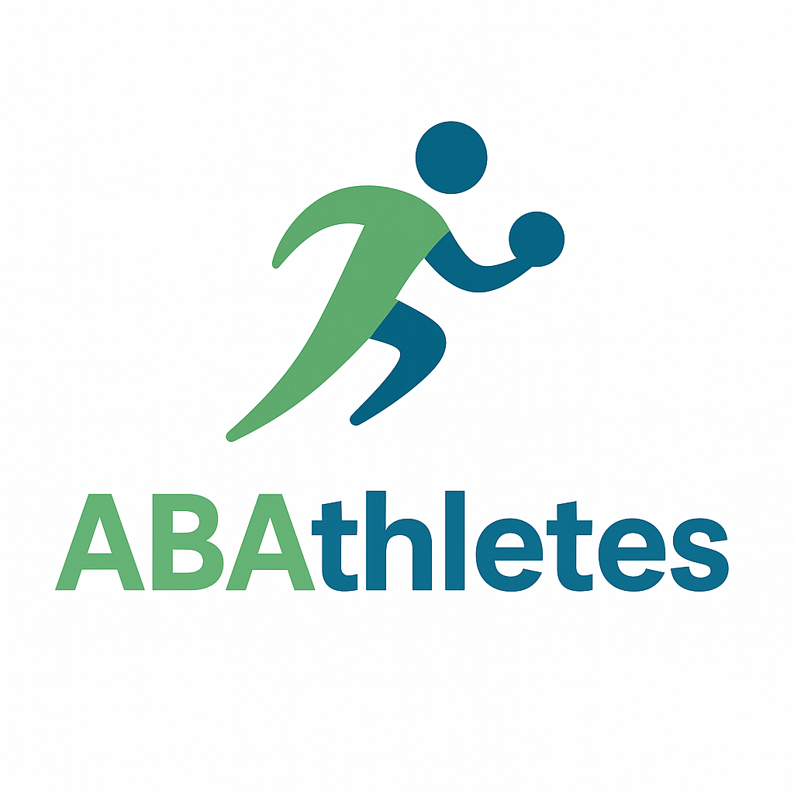

<!DOCTYPE html>

<html lang="en">

<head>

  <meta charset="UTF-8" />

  <meta name="viewport" content="width=device-width, initial-scale=1.0"/>

  <title>ABAthletes - Sports-Based ABA Therapy</title>

  

</head>

<body>

  <header>

    

    <h1>ABAthletes</h1>

    
Where Therapy Meets the Field

  </header>

  <nav>

    <a href="#about">About</a>

    <a href="#programs">Programs</a>

    <a href="#contact">Contact</a>

  </nav>

  

    <h2>Sports-Based ABA Therapy for Kids</h2>

    
Building behavior, confidence, and social skills through movement and play.

  

  

    <h3>About Us</h3>

    
ABAthletes provides Applied Behavior Analysis therapy through fun, engaging, and active programs. We combine traditional ABA goals with sports and physical activity to improve attention, behavior, social interaction, and confidence.

  

  

    <h3>Our Programs</h3>

    <ul>

      <li><strong>Mini Movers (Ages 3–6):</strong> Develop motor skills and behavior through movement play.</li>

      <li><strong>TeamUp ABA (Ages 6–10):</strong> Focus on group skills, teamwork, and emotional control.</li>

      <li><strong>FocusFit (Ages 10–14):</strong> Integrate fitness routines with behavior coaching and self-regulation.</li>

    </ul>

  

  

    <h3>Contact Us</h3>

    
Email: info@abathletes.com

    
Phone: (123) 456-7890

  

  <footer>

    
&copy; 2025 ABAthletes. All rights reserved.

  </footer>

</body>

</html>

